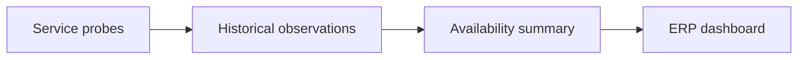
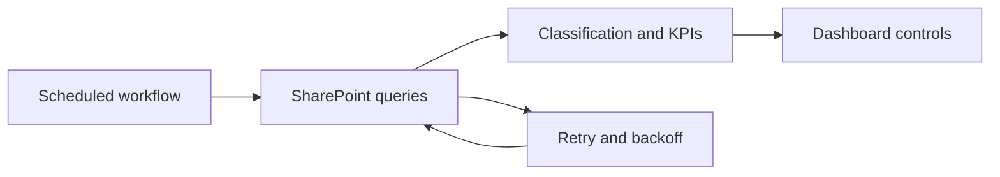
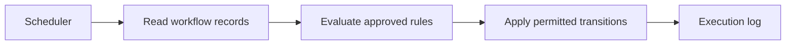
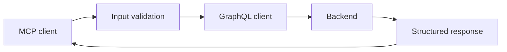
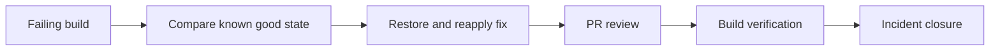
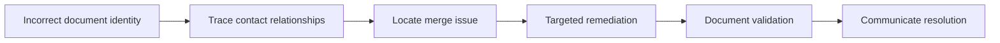

# Work case studies

[Español](CASES.es.md) · [English](CASES.en.md) · [Demos](DEMO-GUIDE.md)

Anonymized descriptions of documented work through September 30, 2026. Original sources remain private. Diagrams are reconstructed explanations, not production screenshots. Demos are new code, separate from historical work. Attribution relies on commits bearing my name and resolution notes; it does not imply exclusive authorship of entire systems.

## 01. Service monitoring and operational visibility

**Period:** 2026-07 · **Technologies:** JavaScript · Cloudflare Workers · Durable Objects · D1 · Odoo · Microsoft Graph

**Problem.** Availability information was scattered across multiple services and needed a consolidated operational view.

**My contribution.** I implemented a monitor using Cloudflare Workers, historical storage in D1, and summary integration with Odoo. The history also records contributions to Microsoft Graph indicators.

**Solution.** Periodic probes record results, a summary aggregates observations, and an integration delivers indicators to the ERP. Delivery failures are tolerated so the next cycle can try again.

**Validation and evidence.** Git contributions attributed to my name and inspection of probing, aggregation, and delivery functions. The public demo tests the concept with synthetic samples; it does not retest production.

**Outcome and limits.** Documented implementation of indicator collection and integration. No achieved uptime percentage or incident reduction is claimed.

## 02. Automated SLA dashboard refresh

**Period:** 2026-04 / 2026-05 · **Technologies:** Node.js · GitHub Actions · SharePoint REST · OAuth 2.0

**Problem.** Departmental indicators needed periodic refreshes, while SharePoint queries could fail due to throttling or transient errors.

**My contribution.** I implemented the refresh workflow using Node.js and GitHub Actions and added backoff retries for SharePoint queries.

**Solution.** The process queries lists, classifies records, calculates indicators, and updates existing dashboard controls. The HTTP layer handles throttling, temporary errors, and Retry-After.

**Validation and evidence.** Git history for the initial implementation and retry improvement; inspection of token acquisition, queries, and classification. The SLA demo tests explicit rules and boundary cases using fictitious data.

**Outcome and limits.** Documented scheduled refresh workflow and transient-error handling. No hours saved or percentage improvement in SLA is claimed without measurement.

## 03. Workflow consistency automation

**Period:** 2026-04 · **Technologies:** Node.js · GitHub Actions · Microsoft Graph · SharePoint

**Problem.** Approval-process requests could retain inconsistent states or require repetitive intervention to apply operational rules.

**My contribution.** I implemented the initial scheduled process in Node.js and GitHub Actions by porting an existing routine. I distinguish that contribution from later extensions recorded under the team account.

**Solution.** A scheduled task inspects records and applies the original process state rules. The public case explains the pattern without distributing employer rules or executing approvals.

**Validation and evidence.** Initial commit attributed to my name and inspection of list traversal and updates. Team extensions are retained as context, without claiming exclusive authorship.

**Outcome and limits.** Documented initial implementation of a scheduled consistency routine. Financial effects and correction counts are not published or simulated as real outcomes.

## 04. GraphQL query integration through MCP

**Period:** 2026-04-03 · **Technologies:** Python · MCP · GraphQL · Hasura · Pydantic · HTTPX

**Problem.** Querying platform information required a structured interface for assistance and analysis tools.

**My contribution.** I implemented a Python MCP server exposing queries to a GraphQL backend, with input models, filters, and pagination.

**Solution.** MCP tools validate input, build query variables, and process GraphQL responses. The code handles HTTP and GraphQL errors and limits returned text size.

**Validation and evidence.** Initial commit attributed to my name and inspection of tools, input models, and the GraphQL client. This supports implementation, not adoption, restricted backend permissions, or performance outcomes.

**Outcome and limits.** Documented MCP query interface for a GraphQL backend. Credentials, endpoint, and platform data remain private.

## 05. Odoo build recovery after a regression

**Period:** 2026-07-02 · **Technologies:** Odoo 19 · XML · Git · GitHub PRs · CI/CD · Incident analysis

**Problem.** A build failed during XML view validation. Investigation identified a wider regression in the repository tree.

**My contribution.** I investigated the cause, restored the repository tree to a known state, and reapplied the required functional correction. I documented validation and incident closure.

**Solution.** Comparison with the last valid state, restoration through a fix branch and PR review, followed by build verification and checks of expected modules.

**Validation and evidence.** Restoration and correction commits attributed to my name, a recorded merge, and a resolution note in an archived ticket. The note reports successful build and deployment; deployment was not rerun for this portfolio.

**Outcome and limits.** Documented build recovery and incident closure. Internal identifiers and impact figures not independently measured are omitted.

## 06. Diagnosis of incorrect identity on ERP documents

**Period:** 2026-06-26 · **Technologies:** Odoo · Data integrity · Root cause analysis · HelpDesk

**Problem.** ERP documents displayed an incorrect customer identity after contact consolidation.

**My contribution.** I diagnosed the connection to a contact merge, documented restoration of the customer on affected documents, and communicated the resolution.

**Solution.** Tracing relationships between contacts and documents, identifying the incorrect association, and correcting identity in a targeted way. This case distributes no mutation scripts and reproduces no financial data.

**Validation and evidence.** Archived ticket in the solved stage, a message attributed to my user, and a resolution communication. The message records restoration without changing amounts or document references; this is presented as a documented outcome, not an independent accounting audit.

**Outcome and limits.** Documented identity restoration and closure. Customer names, documents, amounts, and original screenshots are not published.

