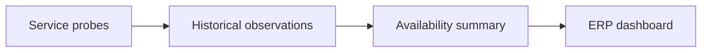
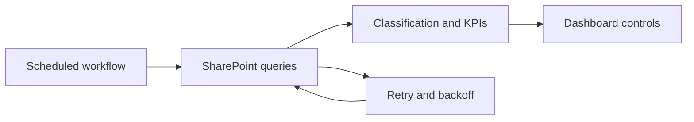
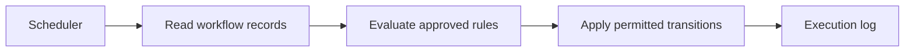
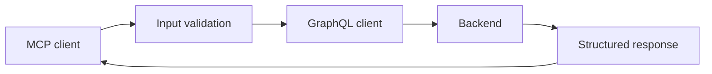
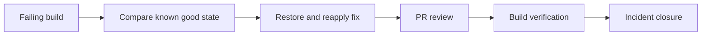
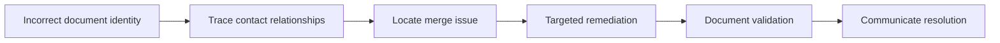

# Casos de trabajo

[Español](CASES.es.md) · [English](CASES.en.md) · [Demos](DEMO-GUIDE.md)

Descripciones anonimizadas de trabajo documentado hasta el 30 de septiembre de 2026. Las fuentes originales permanecen privadas. Los diagramas son explicaciones reconstruidas, no capturas de producción. Las demos son código nuevo, separado del trabajo histórico. La atribución se apoya en commits con mi nombre y notas de resolución; no implica autoría exclusiva de sistemas completos.

## 01. Monitoreo de servicios y visibilidad operativa

**Período:** 2026-07 · **Tecnologías:** JavaScript · Cloudflare Workers · Durable Objects · D1 · Odoo · Microsoft Graph

**Problema.** La información de disponibilidad estaba dispersa entre varios servicios y era difícil consolidarla en una vista operativa.

**Mi aporte.** Implementé un monitor con Cloudflare Workers, almacenamiento histórico en D1 e integración de resúmenes con Odoo. El historial también registra contribuciones a indicadores de Microsoft Graph.

**Solución.** Sondas periódicas registran resultados, un resumen agrega las observaciones y una integración entrega los indicadores al ERP. Los fallos de entrega se toleran para permitir otro intento en el siguiente ciclo.

**Validación y evidencia.** Contribuciones firmadas con mi nombre en Git y revisión de las funciones de sondeo, agregación y envío. La demo pública valida el concepto con muestras ficticias; no vuelve a probar producción.

**Resultado y límites.** Implementación documentada de recolección e integración de indicadores. No se atribuye un porcentaje de disponibilidad alcanzado ni una reducción de incidentes.

## 02. Actualización automatizada de dashboards SLA

**Período:** 2026-04 / 2026-05 · **Tecnologías:** Node.js · GitHub Actions · SharePoint REST · OAuth 2.0

**Problema.** Los indicadores departamentales requerían actualización periódica y las consultas a SharePoint podían fallar por límites de uso o errores transitorios.

**Mi aporte.** Implementé el flujo de actualización con Node.js y GitHub Actions y añadí reintentos con espera progresiva para consultas a SharePoint.

**Solución.** El proceso consulta listas, clasifica registros, calcula indicadores y actualiza controles existentes del dashboard. La capa HTTP contempla respuestas de limitación, errores temporales y Retry-After.

**Validación y evidencia.** Historial Git de la implementación inicial y la mejora de reintentos; revisión de adquisición de tokens, consultas y clasificación. La demo de SLA prueba reglas explícitas y casos límite con datos ficticios.

**Resultado y límites.** Flujo de actualización programada y tratamiento de fallos transitorios documentados. No se afirma ahorro de horas ni mejora porcentual de SLA sin medición.

## 03. Automatización de controles de consistencia en flujos

**Período:** 2026-04 · **Tecnologías:** Node.js · GitHub Actions · Microsoft Graph · SharePoint

**Problema.** Las solicitudes de un proceso de aprobación podían conservar estados incoherentes o requerir intervención repetitiva para aplicar reglas operativas.

**Mi aporte.** Implementé la versión inicial del proceso programado en Node.js y GitHub Actions, trasladando una rutina existente. Distingo ese aporte de ampliaciones posteriores registradas bajo la cuenta del equipo.

**Solución.** Una tarea programada revisa registros y aplica reglas de estado del proceso original. El caso público explica el patrón sin distribuir esas reglas empresariales ni ejecutar aprobaciones.

**Validación y evidencia.** Commit inicial atribuido a mi nombre y revisión del recorrido de listas y actualizaciones. Las ampliaciones del equipo se conservan como contexto, sin atribuirme autoría exclusiva.

**Resultado y límites.** Implementación inicial documentada de una rutina programada de consistencia. El efecto financiero y las cifras de correcciones no se publican ni se simulan como resultados reales.

## 04. Integración de consultas GraphQL mediante MCP

**Período:** 2026-04-03 · **Tecnologías:** Python · MCP · GraphQL · Hasura · Pydantic · HTTPX

**Problema.** La consulta de información de una plataforma requería una interfaz estructurada para herramientas de asistencia y análisis.

**Mi aporte.** Implementé un servidor MCP en Python que expone consultas a un backend GraphQL, con modelos de entrada, filtros y paginación.

**Solución.** Las herramientas MCP validan entradas, construyen variables de consulta y procesan respuestas GraphQL. El código contempla errores HTTP y GraphQL y limita el tamaño del texto devuelto.

**Validación y evidencia.** Commit inicial atribuido a mi nombre y revisión de herramientas, modelos de entrada y cliente GraphQL. Esto demuestra implementación; no demuestra adopción, permisos restringidos del backend o resultados de rendimiento.

**Resultado y límites.** Interfaz de consulta MCP documentada para un backend GraphQL. Las credenciales, el endpoint y los datos de la plataforma se mantienen privados.

## 05. Recuperación de un build de Odoo tras una regresión

**Período:** 2026-07-02 · **Tecnologías:** Odoo 19 · XML · Git · GitHub PRs · CI/CD · Incident analysis

**Problema.** Un build fallaba durante la validación de vistas XML. La investigación identificó una regresión más amplia del árbol del repositorio.

**Mi aporte.** Investigué la causa, restauré el árbol del repositorio a un estado conocido y reapliqué la corrección funcional necesaria. Documenté la validación y el cierre del incidente.

**Solución.** Comparación con el último estado válido, restauración mediante una rama de corrección y revisión por PR, seguida de verificación del build y de los módulos esperados.

**Validación y evidencia.** Commits de restauración y corrección atribuidos a mi nombre, merge registrado y nota de resolución en un ticket archivado. La nota reporta build y despliegue satisfactorios; no se volvió a ejecutar el despliegue para este portafolio.

**Resultado y límites.** Recuperación documentada del build y cierre del incidente. Se omiten identificadores internos y cifras del impacto que no fueron medidas de forma independiente.

## 06. Diagnóstico de identidad incorrecta en documentos ERP

**Período:** 2026-06-26 · **Tecnologías:** Odoo · Data integrity · Root cause analysis · HelpDesk

**Problema.** Documentos del ERP mostraban una identidad de cliente incorrecta después de una consolidación de contactos.

**Mi aporte.** Diagnostiqué la relación con una fusión de contactos, documenté la restauración del cliente en los documentos afectados y comuniqué la resolución.

**Solución.** Trazabilidad entre contactos y documentos, identificación de la asociación incorrecta y corrección focalizada de la identidad. Este caso no distribuye scripts de modificación ni reproduce datos financieros.

**Validación y evidencia.** Ticket archivado en etapa resuelta, mensaje atribuido a mi usuario y comunicación de resolución. El mensaje registra la restauración sin alterar importes ni referencias documentales; se presenta como resultado documentado, no como una auditoría contable independiente.

**Resultado y límites.** Restauración de identidad y cierre documentados. No se publican nombres de clientes, documentos, importes ni capturas originales.

